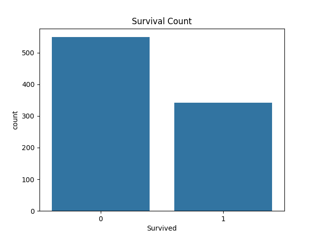
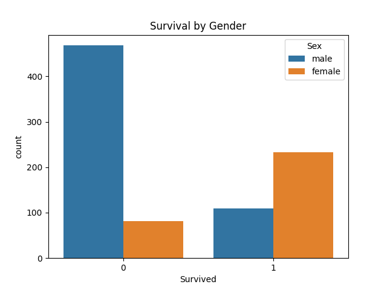
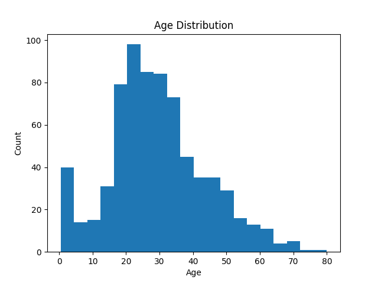
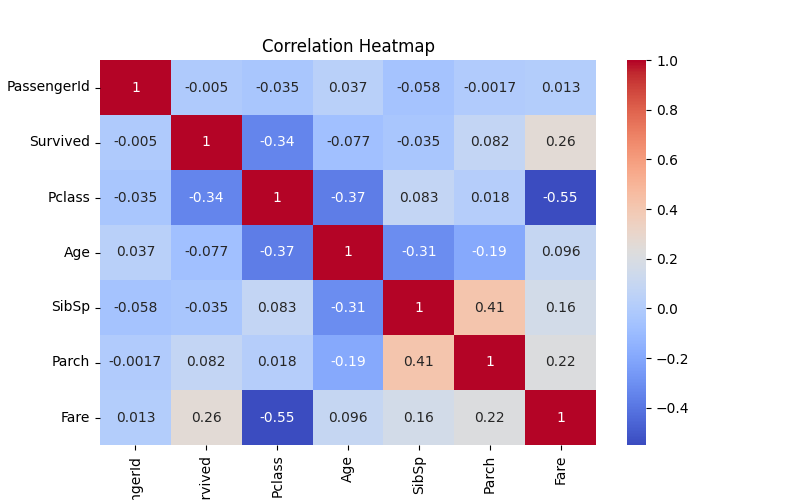

# 🚢 Titanic Data Analysis (Task-02)

---

## 📌 Project Overview
Performed data cleaning and exploratory data analysis (EDA) on Titanic dataset.

---

## 🧹 Data Cleaning
- Filled missing Age values  
- Dropped Cabin column  
- Filled Embarked values  

---

## 📊 Analysis

### Survival Count

### Survival by Gender

### Age Distribution

### Heatmap

---

## 🛠 Tools Used
Python, Pandas, Matplotlib, Seaborn

---

## 💡 Insights
- Females had higher survival rate  
- Age distribution shows majority young passengers  
- Strong correlation between class and survival  

---

## ⭐ Conclusion
EDA helps understand patterns and relationships in data.
